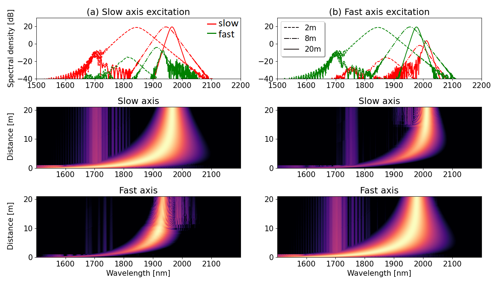

# Soliton trapping and modulation instability in a birefringent microstructured fiber



## Usage

### Installation

1. Create a virtual environment with `python -m venv cgnlse` or using `conda` by `conda create -n cgnlse python=3.8`.
2. Activate it with `. cgnlse/bin/activate` or `conda activate cgnlse`.
3. Install `gnlse` package `pip install gnlse==2.0.0`
3. Clone this repository `git clone https://github.com/WUST-FOG/cgnlse-python.git`

```bash
python -m venv cgnlse
. cnlse/bin/activate
pip install gnlse==2.0.0
git clone https://github.com/WUST-FOG/cgnlse-python.git
cd cgnlse-python
```

### Examples

**Soliton trapping and orthogonal Raman scattering**

Run test script to generate above figure and reproduce the manuscript results:

```bash
python draw_soliton_traping.py
```

Note that we also provided script tu run simulations (`run_soliton_traping.py`),
however used input data is not publicly available at this time,
but may be obtained from the authors upon reasonable request.

**Modulation instability in highly birefringent fibers**

To run example of vector modulation instability in highly birefringent
fibers with circularly polarized modes in the normal dispersion regime
type:

```bash
python run_modulation_instability.py
```

Note that using also raman_polarisation and setting solver.fr to 0
one can simulate the case of low-birefringent fibers.

## Acknowledgement

cnlse-python is a Python set of scripts for solving
Coupled Nonlinear Schrodringer Equation. It is one of the WUST-FOG
projects developed by [Fiber Optics Group, WUST](http://www.fog.pwr.edu.pl/).

The python code based on `gnlse` package, available at 
[https://github.com/WUST-FOG/gnlse-python](https://github.com/WUST-FOG/gnlse-python).

## Citation

If you find this code useful in your research, please consider citing:

```
@misc{stefanska2022soliton_traping,
      title={Soliton trapping and orthogonal Raman scattering in
             a birefringent microstructured fiber}, 
      author={Karolina Stefańska and Sylwia Majchrowska and Karolina Gemza and Grzegorz Soboń
              and Jarosław Sotor and Paweł Mergo and Karol Tarnowski and Tadeusz Martynkien},
      year={2022},
      eprint={},
      archivePrefix={arXiv},
      primaryClass={physics.optics}
}
```

## License
[MIT](https://choosealicense.com/licenses/mit/)
